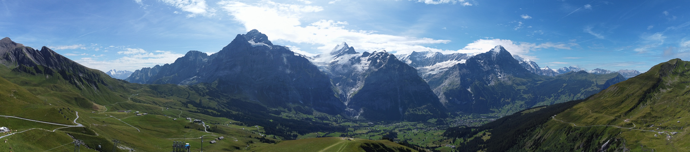

  

<h1 align="center">Hi, I'm Aryan Ovalekar 👋</h1>

I'm a Computer Science and Data Science undergraduate at Rutgers University – New Brunswick. I focus on full-stack development, serverless computing, and building data-driven models. Alongside my academic work, I enjoy working on my homelab and doing photography.  

  

